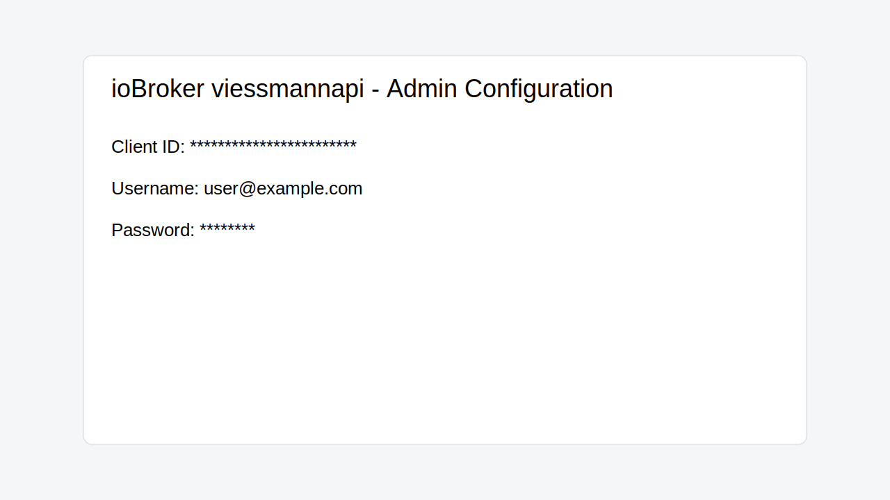
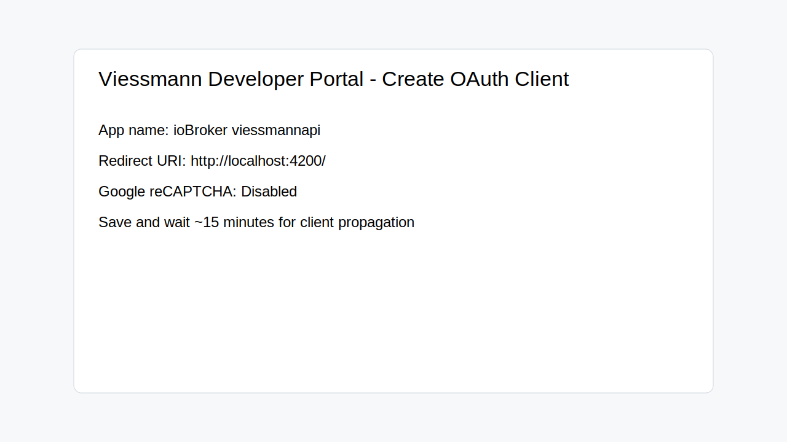

# ioBroker.viessmannapi

> **Maintained fork notice:** This repository is a maintained fork of the original `TA2k/ioBroker.viessmannapi` adapter. The adapter name stays `iobroker.viessmannapi` for ioBroker compatibility, while this fork continues maintenance, dependency updates, and compatibility work. The fork is not published to npm — install it from this GitHub repository (see the installation section).

## Deutsch

## Überblick

`ioBroker.viessmannapi` verbindet ioBroker mit der Viessmann Developer Cloud API. Der Adapter liest Installationen, Gateways, Geräte, Features, Events und Messwerte aus und legt sie als ioBroker-Objekte und States an. Schreibbare Viessmann-Befehle werden als `setValue`-States abgebildet, sodass sie aus Visualisierungen, Skripten oder Automationen heraus genutzt werden können.

Typische Einsatzzwecke:

- Heizung, Warmwasser, Wärmepumpe, Lüftung und weitere Viessmann-Features überwachen.
- Temperaturen, Betriebsarten, Programme, Statistiken und Statusinformationen in ioBroker protokollieren.
- Unterstützte Remote-Befehle über Viessmann Command-Endpoints ausführen.
- API-Aufrufe durch Geräte- und Feature-Filter reduzieren.

## Fork-Status

Diese Version ist als Fork gekennzeichnet und wird unabhängig vom ursprünglichen Repository gepflegt. Die Historie und der Ursprung bleiben erhalten; neue Änderungen in diesem Fork konzentrieren sich auf aktuelle Laufzeit-Anforderungen, sichere Protokollierung, robustere Authentifizierung, Tests und Dokumentation.

## Aktuelle Version

### 2.5.1

Release-Schwerpunkte:

- Verbesserte Behandlung von Authentifizierungsfehlern und Token-Erneuerung.
- Klareres Retry-Verhalten für API-Kommandos.
- Zusätzliche Tests für Request-Flows, Authentifizierung und sichere Log-Ausgaben.
- Aktualisierte Projektanforderungen für moderne ioBroker-Installationen.
- Aktualisierte Dokumentation mit deutschem und englischem Abschnitt.

## Anforderungen

- Node.js `>=20 <25` (Node.js 20, 22 und 24 werden von der CI-Matrix abgedeckt).
- js-controller `>=7.0.7`.
- admin `>=7.7.2`.
- Eine Viessmann Developer App mit OAuth Client ID.
- Eine unterstützte Viessmann-Anlage bzw. ein unterstütztes Gateway/Gerät in der Viessmann Cloud.

## Installation und Einrichtung

1. Adapter aus GitHub installieren — dieser Fork wird **nicht** auf npm veröffentlicht (der npm-Paketname gehört dem ursprünglichen Autor):
   - **Admin-UI:** Expertenmodus aktivieren, dann unter „Adapter" auf das GitHub-Symbol („Aus eigener URL installieren") klicken und im Tab „Eigene" diese URL eintragen: `https://github.com/riessfa/ioBroker.viessmannapi`.
   - **Kommandozeile (alternativ):** `iobroker url https://github.com/riessfa/ioBroker.viessmannapi`
2. Viessmann Developer App öffnen: <https://app.developer.viessmann-climatesolutions.com/>.
3. Eine Client ID für den Adapter erstellen.
4. In der Viessmann Developer App Google reCAPTCHA deaktivieren.
5. Redirect URI eintragen: `http://localhost:4200/`.
6. Client ID in den Adapter-Einstellungen eintragen.
7. Viessmann Benutzername und Passwort in den Adapter-Einstellungen eintragen.
8. Optional Filter konfigurieren, um API-Limits zu schonen.

## Adapter-Konfiguration

| Einstellung | Standard | Beschreibung |
| --- | --- | --- |
| `username` | leer | Viessmann Account-E-Mail. |
| `password` | leer | Viessmann Account-Passwort; wird von ioBroker geschützt gespeichert. |
| `client_id` | leer | OAuth Client ID aus der Viessmann Developer App; wird geschützt gespeichert. |
| `interval` | `5` | Polling-Intervall für Features in Minuten. |
| `eventInterval` | `300` | Polling-Intervall für Events in Minuten. |
| `gatewayIndex` | `1` | Gateway-Auswahl, falls mehrere Gateways vorhanden sind. |
| `devicelist` | leer | Kommagetrennte Allowlist für Device IDs. |
| `featureFilter` | leer | Kommagetrennter Feature-Filter; Wildcard `*` wird unterstützt. |
| `allowVirtual` | `false` | Virtuelle Geräte, z. B. Einzelraumsteuerungen, einbeziehen. |

## API-Limits und Empfehlungen

Die Viessmann API hat Tageslimits. Konfigurieren Sie den Adapter so, dass nur benötigte Geräte und Features abgefragt werden:

- Polling-Intervall nicht unnötig klein setzen.
- `devicelist` verwenden, wenn nur bestimmte Geräte relevant sind.
- `featureFilter` verwenden, z. B. `heating.boiler.*` oder `heating.dhw.temperature`.
- Virtuelle Geräte nur aktivieren, wenn sie wirklich benötigt werden.

## Beispiele für Datenpunkte

Außentemperatur:

```text
viessmannapi.0.XXXXX.0.features.heating.sensors.temperature.outside.properties.value.value
```

Remote-Befehl für Warmwasser-Zieltemperatur:

```text
viessmannapi.0.XXXXX.0.features.heating.dhw.temperature.main.commands.setTargetTemperature.setValue
```

Weitere häufige Datenpunkte:

```text
Vorlauftemperatur:
viessmannapi.0.XXXX.features.heating.circuits.0.sensors.temperature.supply.properties.value.value

Anzahl Zündungen:
viessmannapi.0.XXXXX.features.heating.burners.0.statistics.properties.starts.value

Betriebsstunden:
viessmannapi.0.XXXXX.features.heating.burners.0.statistics.properties.hours.value

Kesseltemperatur:
viessmannapi.0.XXXXX.features.heating.boiler.sensors.temperature.main.properties.unit.value

Kompressor aktiv:
viessmannapi.0.xxx.0.features.heating.compressors.0.properties.active.value

Heizkreispumpe aktiv:
viessmannapi.0.xxx.0.features.heating.circuits.1.circulation.pump.properties.status.value

Warmwasserbereitung:
viessmannapi.0.xxx.0.features.heating.dhw.charging.properties.active.value

Heizungsmodus:
viessmannapi.0.xxx.0.features.heating.circuits.1.operating.modes.active.properties.value.value

Heizprogramm:
viessmannapi.0.xxx.0.features.heating.circuits.1.operating.programs.active.properties.value.value

Warmwasser Soll-Temperatur:
viessmannapi.0.xxx.0.features.heating.dhw.temperature.properties.value.value

Warmwasser Ist-Temperatur:
viessmannapi.0.xxx.0.features.heating.dhw.sensors.temperature.dhwCylinder.properties.value.value

Statistik Kompressor Starts:
viessmannapi.0.xxx.0.features.heating.compressors.0.statistics.properties.starts.value

Statistik Kompressor Stunden:
viessmannapi.0.xxx.0.features.heating.compressors.0.statistics.properties.hours.value
```

## Beispiel: Schedule setzen

```javascript
const standard = {
  mon: [{ start: '00:00', end: '24:00', mode: 'standard', position: 0 }],
  tue: [{ start: '00:00', end: '24:00', mode: 'standard', position: 0 }],
  wed: [{ start: '00:00', end: '24:00', mode: 'standard', position: 0 }],
  thu: [{ start: '00:00', end: '24:00', mode: 'standard', position: 0 }],
  fri: [{ start: '00:00', end: '24:00', mode: 'standard', position: 0 }],
  sat: [{ start: '00:00', end: '24:00', mode: 'standard', position: 0 }],
  sun: [{ start: '00:00', end: '24:00', mode: 'standard', position: 0 }],
};

setState('viessmannapi.0.xxxxxxx.0.features.ventilation.schedule.commands.setSchedule.setValue', standard);
```

## Unterstützte Geräte und Datenpunkte

Viessmann stellt die aktuellen Kompatibilitäts- und Datenpunktlisten bereit:

- Kompatibilitätsliste: <https://documentation.viessmann.com/static/compatibility>
- Datenpunkte: <https://documentation.viessmann.com/static/iot/data-points>
- API-Community: <https://www.viessmann-community.com/t5/The-Viessmann-API/bd-p/dev-viessmann-api>

Fragen zu fehlenden Datenpunkten bitte direkt an Viessmann richten, da der Adapter nur die von der Viessmann API gelieferten Features abbilden kann.


## Screenshots

Admin-Konfiguration in ioBroker (Client ID / Username / Password):



Viessmann Developer Portal (Client-Erstellung):



## Fehlerbehebung

- **"Cannot find clientId in the viessmann Account"**: Nach dem Erstellen eines neuen Clients bis zu **15 Minuten** warten, bis der Client in der IAM-Umgebung verfügbar ist.
- **"Invalid redirection URI"**: Die Redirect URI muss exakt `http://localhost:4200/` sein — inklusive **Trailing Slash**.
- **`429 Too Many Requests`**: Viessmann-Tageslimit erreicht; Rücksetzung erfolgt täglich um **02:00 UTC**. Polling über `interval` und `eventInterval` erhöhen und die Abfrage mit `devicelist`/`featureFilter` eingrenzen.
- **Token-Refresh schlägt wiederholt fehl**: Der Adapter plant automatisch nach **1 Minute** einen vollständigen Re-Login (`scheduleRelogin` in `lib/auth.js`).

## Entwicklung

```bash
npm ci
npm run lint
npm run check
npm run test
```

Wichtige Skripte:

| Befehl | Zweck |
| --- | --- |
| `npm run lint` | ESLint-Prüfung. |
| `npm run check` | TypeScript-Check ohne Build-Ausgabe. |
| `npm run test:js` | Mocha-Tests für Adapterlogik. |
| `npm run test:package` | ioBroker Package-Validierung. |
| `npm run test` | Führt `test:js` und `test:package` aus. |

---

## English

## Overview

`ioBroker.viessmannapi` connects ioBroker with the Viessmann Developer Cloud API. The adapter discovers installations, gateways, devices, features, events, and measurements, then exposes them as ioBroker objects and states. Writable Viessmann commands are represented as `setValue` states for use in scripts, automations, and visualizations.

Common use cases:

- Monitor heating, domestic hot water, heat pumps, ventilation, and other Viessmann features.
- Log temperatures, operating modes, programs, statistics, and status information in ioBroker.
- Execute supported remote commands through Viessmann command endpoints.
- Reduce API traffic with device and feature filters.

## Fork status

This repository is a maintained fork of the original project. The project history and origin are preserved, while this fork focuses on current runtime requirements, safer logging, more robust authentication, tests, and documentation updates.

## Current release

### 2.5.1

Release highlights:

- Improved authentication failure handling and token refresh behavior.
- Clearer retry behavior for API commands.
- Additional tests for request flows, authentication, and safe log output.
- Updated project requirements for modern ioBroker installations.
- Updated documentation with German and English sections.

## Requirements

- Node.js `>=20 <25` (Node.js 20, 22, and 24 are covered by the CI matrix).
- js-controller `>=7.0.7`.
- admin `>=7.7.2`.
- A Viessmann Developer App with an OAuth Client ID.
- A supported Viessmann installation or gateway/device connected to the Viessmann Cloud.

## Installation and setup

1. Install the adapter from GitHub — this fork is **not** published to npm (the npm package name belongs to the original author):
   - **Admin UI:** enable expert mode, then on the "Adapters" page click the GitHub icon ("Install from custom URL") and enter this URL on the "Custom" tab: `https://github.com/riessfa/ioBroker.viessmannapi`.
   - **Command line (alternative):** `iobroker url https://github.com/riessfa/ioBroker.viessmannapi`
2. Open the Viessmann Developer App: <https://app.developer.viessmann-climatesolutions.com/>.
3. Create a Client ID for the adapter.
4. Disable Google reCAPTCHA for the app.
5. Configure the redirect URI: `http://localhost:4200/`.
6. Copy the Client ID into the adapter settings.
7. Enter your Viessmann username and password in the adapter settings.
8. Optionally configure filters to reduce API usage.

## Adapter configuration

| Setting | Default | Description |
| --- | --- | --- |
| `username` | empty | Viessmann account email. |
| `password` | empty | Viessmann account password; stored protected by ioBroker. |
| `client_id` | empty | OAuth Client ID from the Viessmann Developer App; stored protected. |
| `interval` | `5` | Feature polling interval in minutes. |
| `eventInterval` | `300` | Event polling interval in minutes. |
| `gatewayIndex` | `1` | Gateway selection when multiple gateways exist. |
| `devicelist` | empty | Comma-separated allowlist for device IDs. |
| `featureFilter` | empty | Comma-separated feature filter; wildcard `*` is supported. |
| `allowVirtual` | `false` | Include virtual devices, such as room controls. |

## API limits and recommendations

The Viessmann API has daily limits. Configure the adapter to poll only the devices and features you need:

- Do not set polling intervals lower than necessary.
- Use `devicelist` when only selected devices are relevant.
- Use `featureFilter`, for example `heating.boiler.*` or `heating.dhw.temperature`.
- Enable virtual devices only when you actually need them.

## Data point examples

Outside temperature:

```text
viessmannapi.0.XXXXX.0.features.heating.sensors.temperature.outside.properties.value.value
```

Remote command for domestic hot water target temperature:

```text
viessmannapi.0.XXXXX.0.features.heating.dhw.temperature.main.commands.setTargetTemperature.setValue
```

Additional common data points:

```text
Supply temperature:
viessmannapi.0.XXXX.features.heating.circuits.0.sensors.temperature.supply.properties.value.value

Burner starts:
viessmannapi.0.XXXXX.features.heating.burners.0.statistics.properties.starts.value

Burner operating hours:
viessmannapi.0.XXXXX.features.heating.burners.0.statistics.properties.hours.value

Boiler temperature:
viessmannapi.0.XXXXX.features.heating.boiler.sensors.temperature.main.properties.unit.value

Compressor active:
viessmannapi.0.xxx.0.features.heating.compressors.0.properties.active.value

Heating circuit pump active:
viessmannapi.0.xxx.0.features.heating.circuits.1.circulation.pump.properties.status.value

Domestic hot water charging:
viessmannapi.0.xxx.0.features.heating.dhw.charging.properties.active.value

Heating mode:
viessmannapi.0.xxx.0.features.heating.circuits.1.operating.modes.active.properties.value.value

Heating program:
viessmannapi.0.xxx.0.features.heating.circuits.1.operating.programs.active.properties.value.value

Domestic hot water target temperature:
viessmannapi.0.xxx.0.features.heating.dhw.temperature.properties.value.value

Domestic hot water actual temperature:
viessmannapi.0.xxx.0.features.heating.dhw.sensors.temperature.dhwCylinder.properties.value.value

Compressor starts statistic:
viessmannapi.0.xxx.0.features.heating.compressors.0.statistics.properties.starts.value

Compressor hours statistic:
viessmannapi.0.xxx.0.features.heating.compressors.0.statistics.properties.hours.value
```

## Example: setting a schedule

```javascript
const standard = {
  mon: [{ start: '00:00', end: '24:00', mode: 'standard', position: 0 }],
  tue: [{ start: '00:00', end: '24:00', mode: 'standard', position: 0 }],
  wed: [{ start: '00:00', end: '24:00', mode: 'standard', position: 0 }],
  thu: [{ start: '00:00', end: '24:00', mode: 'standard', position: 0 }],
  fri: [{ start: '00:00', end: '24:00', mode: 'standard', position: 0 }],
  sat: [{ start: '00:00', end: '24:00', mode: 'standard', position: 0 }],
  sun: [{ start: '00:00', end: '24:00', mode: 'standard', position: 0 }],
};

setState('viessmannapi.0.xxxxxxx.0.features.ventilation.schedule.commands.setSchedule.setValue', standard);
```

## Supported devices and data points

Viessmann provides the current compatibility and data point references:

- Compatibility list: <https://documentation.viessmann.com/static/compatibility>
- Data points: <https://documentation.viessmann.com/static/iot/data-points>
- API community: <https://www.viessmann-community.com/t5/The-Viessmann-API/bd-p/dev-viessmann-api>

Questions about missing data points should be directed to Viessmann because the adapter can only expose features returned by the Viessmann API.


## Screenshots

Admin configuration in ioBroker (Client ID / Username / Password):


Viessmann Developer Portal (client creation):


## Troubleshooting

- **"Cannot find clientId in the viessmann Account"**: Wait up to **15 minutes** after creating a new client before it is propagated in IAM.
- **"Invalid redirection URI"**: The redirect URI must be exactly `http://localhost:4200/` with the **trailing slash**.
- **`429 Too Many Requests`**: The Viessmann daily rate limit was reached; it resets daily at **02:00 UTC**. Increase `interval`/`eventInterval` and narrow requests via `devicelist`/`featureFilter`.
- **Token refresh keeps failing**: The adapter automatically falls back to a full re-login after **1 minute** (`scheduleRelogin` in `lib/auth.js`).

## Development

```bash
npm ci
npm run lint
npm run check
npm run test
```

Important scripts:

| Command | Purpose |
| --- | --- |
| `npm run lint` | Run ESLint. |
| `npm run check` | Run TypeScript checking without build output. |
| `npm run test:js` | Run Mocha tests for adapter logic. |
| `npm run test:package` | Run ioBroker package validation. |
| `npm run test` | Run `test:js` and `test:package`. |

## Changelog

### 2.5.1 (2026-05-19)

- Added contribution and troubleshooting guides for this maintained fork.
- Expanded JSDoc coverage in `lib` helpers to improve editor hints and static checks.
- Added test coverage for wrapped callback error handling in auth scheduling.

### 2.5.0 (2026-05-16)

- Mark repository as a maintained fork.
- Update runtime requirements to Node.js `>=20 <25`, js-controller `>=7.0.7`, and admin `>=7.7.2`.
- Document authentication, retry, safe logging, request-flow test coverage, and project-maintenance updates.
- Rework README into German and English sections without embedded images.

### 2.4.5 (2026-05-01)

- Remove logbook from objects.

### 2.4.4 (2025-12-16)

- Fix deprecated endpoint usage.

### 2.4.3 (2025-08-10)

- Fix new role preventing data updates.

### 2.4.2 (2025-07-11)

- Change API host name.

### 2.4.1 (2025-03-31)

- Update to new Viessmann API.

### 2.3.2

- Fix login flow.

## License

MIT License

Copyright (c) 2023-2030 TA2k <tombox2020@gmail.com>

Permission is hereby granted, free of charge, to any person obtaining a copy
of this software and associated documentation files (the "Software"), to deal
in the Software without restriction, including without limitation the rights
to use, copy, modify, merge, publish, distribute, sublicense, and/or sell
copies of the Software, and to permit persons to whom the Software is
furnished to do so, subject to the following conditions:

The above copyright notice and this permission notice shall be included in all
copies or substantial portions of the Software.

THE SOFTWARE IS PROVIDED "AS IS", WITHOUT WARRANTY OF ANY KIND, EXPRESS OR
IMPLIED, INCLUDING BUT NOT LIMITED TO THE WARRANTIES OF MERCHANTABILITY,
FITNESS FOR A PARTICULAR PURPOSE AND NONINFRINGEMENT. IN NO EVENT SHALL THE
AUTHORS OR COPYRIGHT HOLDERS BE LIABLE FOR ANY CLAIM, DAMAGES OR OTHER
LIABILITY, WHETHER IN AN ACTION OF CONTRACT, TORT OR OTHERWISE, ARISING FROM,
OUT OF OR IN CONNECTION WITH THE SOFTWARE OR THE USE OR OTHER DEALINGS IN THE
SOFTWARE.
